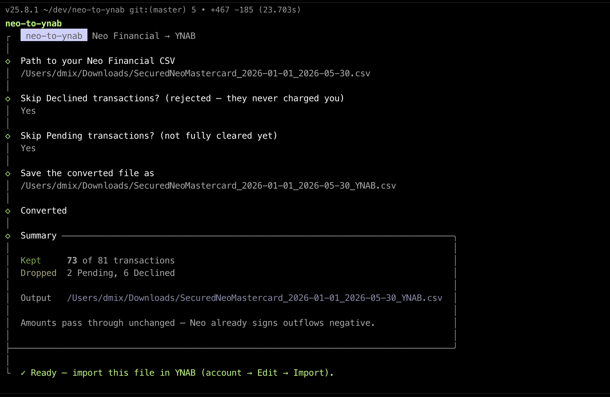

# neo-to-ynab

A small Node CLI that converts a **Neo Financial** CSV export into a **YNAB**
(You Need A Budget) file-based import. It has a scriptable headless mode and a
colorful interactive wizard.



## Why

Neo exports columns YNAB's importer doesn't recognise:

```
Transaction Date, Posted Date, Status, Description, Amount
```

The two date columns plus `Status` confuse YNAB's auto-mapper, so the import is
rejected. This tool rewrites the file into the layout YNAB expects:

```
Date, Payee, Memo, Amount
```

Neo's `Amount` is already signed the way YNAB wants (outflows negative, inflows
positive), so amounts pass straight through.

## Requirements

Node.js 20.12 or newer. Install dependencies once:

```bash
npm install
```

## Usage

### Interactive (recommended)

Run it with no arguments in a terminal and it walks you through everything —
paste the path to your CSV, then answer a few prompts:

```bash
node convert.js
```

### Headless (scriptable)

```bash
node convert.js <input.csv> [options]
```

The converted file is written next to the input as `<input>_YNAB.csv` unless you
pass `-o`.

### Options

| Option                | Description                                                   |
| --------------------- | ------------------------------------------------------------- |
| `-o, --output <path>` | Output file path (default: `<input>_YNAB.csv`)                |
| `-i, --interactive`   | Force the interactive wizard                                  |
| `--skip-pending`      | Exclude `Pending` transactions                                |
| `--keep-pending`      | Include `Pending` transactions **(default)**                  |
| `--skip-declined`     | Exclude `Declined` transactions **(default)**                 |
| `--keep-declined`     | Include `Declined` transactions                               |
| `--posted-only`       | Keep only `Posted` rows (= `--skip-pending --skip-declined`)  |
| `--memo-status`       | Write the Neo status into the YNAB `Memo` for non-Posted rows |
| `-h, --help`          | Show help                                                     |

### Defaults

- **Declined** rows are **dropped** — they were rejected and never charged your
  account, so importing them would create phantom outflows and throw off your
  balance.
- **Pending** rows are **kept** — they're real spending. YNAB de-duplicates on
  import, so re-importing later (once they post) is safe. Use `--skip-pending`
  if you'd rather wait until they clear.

## Examples

```bash
# Recommended default (drops Declined, keeps Pending)
node convert.js ~/Downloads/EverydaySpending_2026-01-01_2026-05-30.csv

# Only fully-posted transactions
node convert.js ~/Downloads/EverydaySpending.csv --posted-only

# Drop pending, choose the output name
node convert.js ~/Downloads/EverydaySpending.csv --skip-pending -o ~/Desktop/ynab.csv
```

Sample output (colorized in a real terminal):

```
neo-to-ynab · Neo Financial → YNAB

  ✓ Converted 509 of 535 transactions
  – Dropped 26 Declined

  source  ~/Downloads/EverydaySpending_2026-01-01_2026-05-30.csv
  output  ~/Downloads/EverydaySpending_2026-01-01_2026-05-30_YNAB.csv

  Amounts pass through unchanged — Neo already signs outflows negative.
  Next: open the account in YNAB → Edit → Import → pick this file.
```

## Importing into YNAB

1. In YNAB, open the target account.
2. **Edit → Import** (or drag the `_YNAB.csv` file onto the account).
3. Confirm the `Date` / `Payee` / `Amount` mapping.
4. Review and import. YNAB skips duplicates automatically.

## Note on transfers

Some Neo rows are internal transfers (e.g. `Transfer to High-Interest account`,
`Payment to Credit`, credit-card payments). If you also track those accounts in
YNAB, categorise them as **transfers** after import so they aren't double-counted
as spending.

## Optionally install as a command

```bash
cd neo-to-ynab
npm link            # makes `neo-to-ynab` available on your PATH
neo-to-ynab ~/Downloads/EverydaySpending.csv
```

## Formatting

Code is formatted with [oxfmt](https://oxc.rs/docs/guide/usage/formatter) using
its defaults (no config file).

```bash
npm run format        # format in place
npm run format:check  # verify formatting without writing (CI-friendly)
```

## Project layout

- `core.js` — pure conversion logic (CSV parse/serialize + status filtering), no I/O or UI.
- `convert.js` — the CLI: argument parsing, the headless run, and the interactive wizard.

Runtime dependencies: [`@clack/prompts`](https://www.npmjs.com/package/@clack/prompts)
for the interactive prompts and [`picocolors`](https://www.npmjs.com/package/picocolors)
for colored output.
